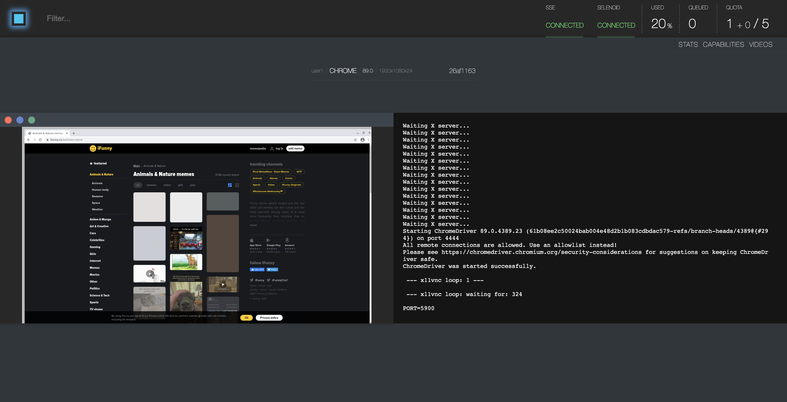
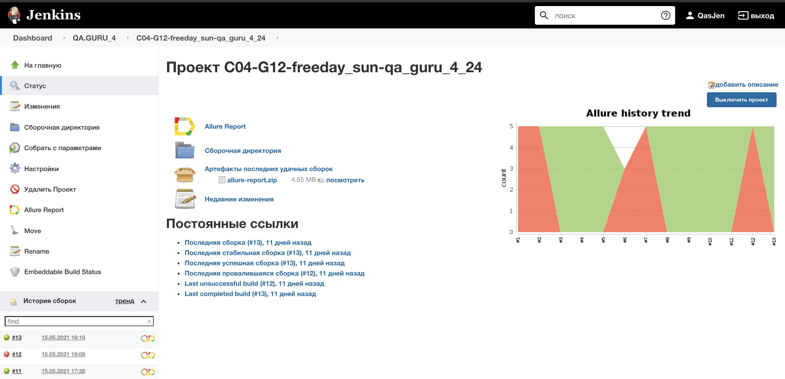
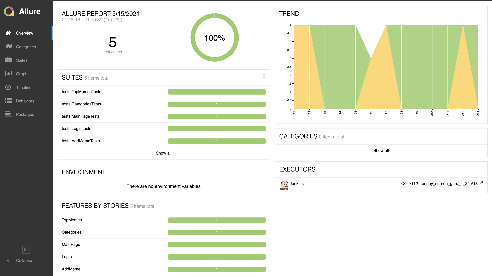
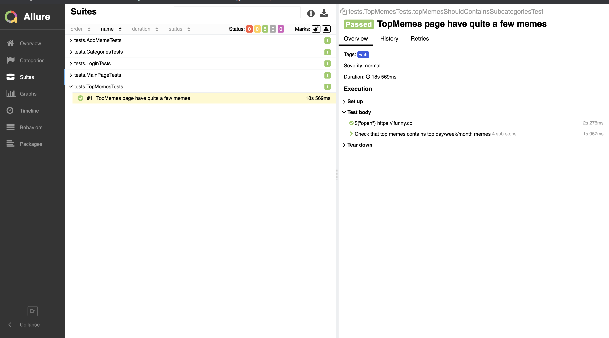
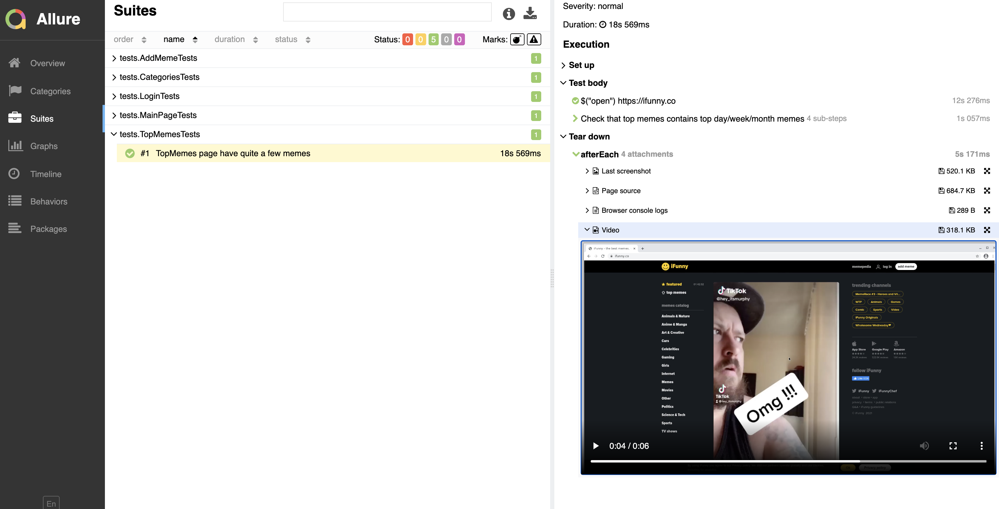
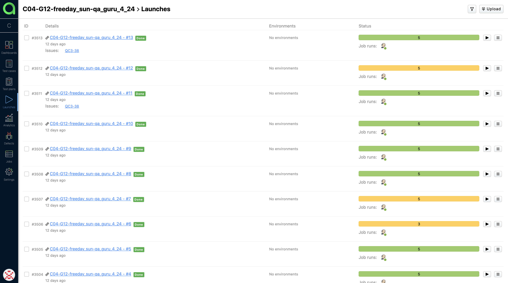
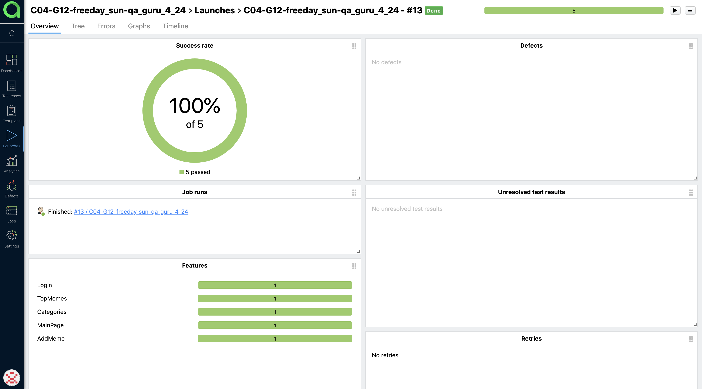
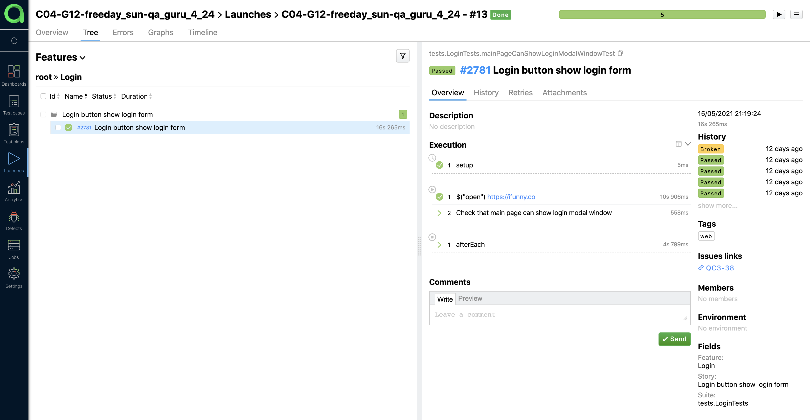
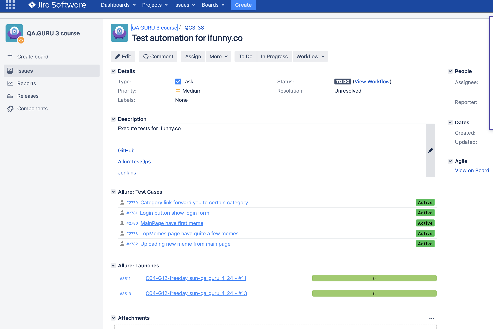
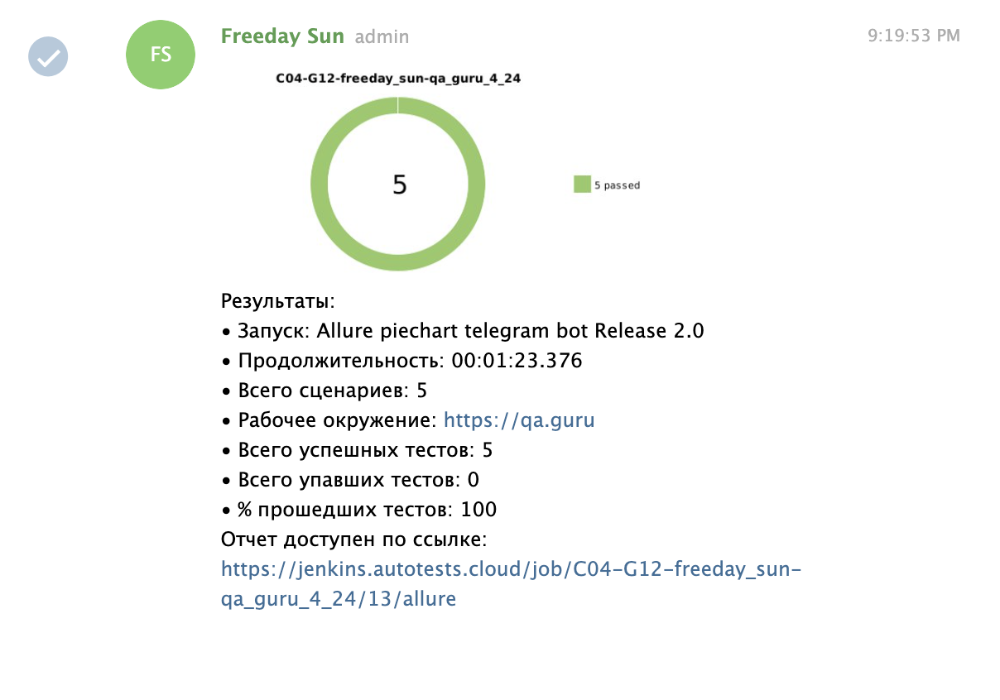

# Autotest for [ifunny.co](https://ifunny.co/)
## Technology Stack
**Java, Gradle, Junit5, Selenide, Selenoid, Allure Reports, Allure TestOps, Jira, Telegram Bot.**
  
## Executed test:

- [X] - Main page have at least one meme
- [X] - Login button in main page show login form
- [X] - Try to add meme without authorization
- [X] - Categories link from main page forward to certain category
- [X] - TopMemes link from main page forward to certain category
## Video example of test executing

  
## Screenshots
#### *Remote Selenoid server for Selenium:*

 
 
 
#### *CI-system Jenkins*

 
 
 
#### *Allure Report for reports:*

 
 
 
#### *Allure TestOps for flexible test management:*

 
 
 
#### *Jira integration:*

 
 
 
#### *Telegram notifications:*
